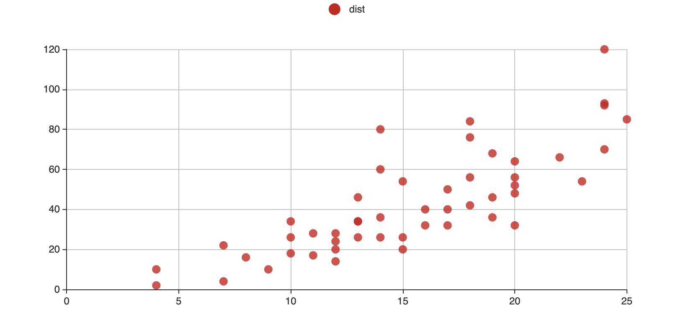

<div align="center">


<br />
<br />

[](https://travis-ci.org/JohnCoene/echarts4r) [](https://ci.appveyor.com/project/JohnCoene/echarts4r) [](https://www.tidyverse.org/lifecycle/#stable) [](https://github.com/JohnCoene/echarts4r/releases) [](https://github.com/JohnCoene/echarts4r/issues) [](https://cranlogs.r-pkg.org/badges/echarts4r) [](https://github.com/JohnCoene/echarts4r) [](https://coveralls.io/github/JohnCoene/echarts4r)

[Apache ECharts (incubating)](https://echarts.apache.org/) version 4 for R.

[Website](https://echarts4r.john-coene.com) |
[Shiny Demo](https://shiny.john-coene.com/echarts4rShiny/) | [Get
Started](https://echarts4r.john-coene.com/articles/get_started.html)

</div>

## Example

Basic example.

```r
library(echarts4r)

e_chart(cars, speed) %>% 
  e_scatter(dist, symbolSize = 10)
```



## Get it

Stable version from CRAN.

```r
install.packages("echarts4r")
```

The development version from Github.

```r
# install.packages("remotes")
remotes::install_github("JohnCoene/echarts4r")
```

## Code of Conduct

Please note that the echarts4r project is released with a [Contributor Code of Conduct](https://github.com/JohnCoene/echarts4r/blob/master/CODE_OF_CONDUCT.md). By contributing to this project, you agree to abide by its terms.
